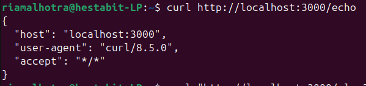

# API Investigation Report

## Objective
The goal of this investigation is to understand and analyze:
- HTTP request and response headers
- Pagination concepts in APIs
- HTTP caching behavior using cache-control headers

This analysis is performed using a custom Node.js HTTP server and `curl` commands.

## 1. HTTP Headers Analysis

HTTP headers carry metadata about the request and response.
To inspect incoming request headers, the `/echo` endpoint was used.

### Command Used

curl http://localhost:3000/echo

**output**

---

### Explanation 

### Analysis
- `host`: Indicates the server address and port the client is connecting to.
- `user-agent`: Identifies the client making the request (curl in this case).
- `accept`: Specifies the response content types the client can handle.

This confirms that the server correctly receives and parses HTTP request headers.

## 2. Pagination Analysis

Pagination is a technique used by APIs to return large datasets in smaller chunks
instead of sending all data in a single response.

### Common Pagination Parameters
- `page`: Current page number
- `limit`: Number of items per page
- `offset`: Number of items to skip

Example:
GET /users?page=2&limit=10

### Why Pagination is Important
- Improves performance
- Reduces memory usage
- Prevents large payloads
- Improves user experience

In this investigation, the `/slow` endpoint demonstrates how delayed or heavy
responses can impact performance, reinforcing the need for pagination
in real-world APIs.

### command used

curl "http://localhost:3000/slow?ms=2000"

**output**

## 3. HTTP Caching Analysis

Caching allows clients and proxies to store responses and reuse them
without re-fetching data from the server.

### Command Used

curl -I http://localhost:3000/cache

**output**

## Conclusion

This investigation demonstrates a practical understanding of:
- HTTP request and response headers
- API pagination concepts and their importance
- HTTP caching mechanisms and cache-control headers

Using a custom Node.js HTTP server and curl-based testing,
the behavior of real-world APIs was successfully analyzed and verified.
